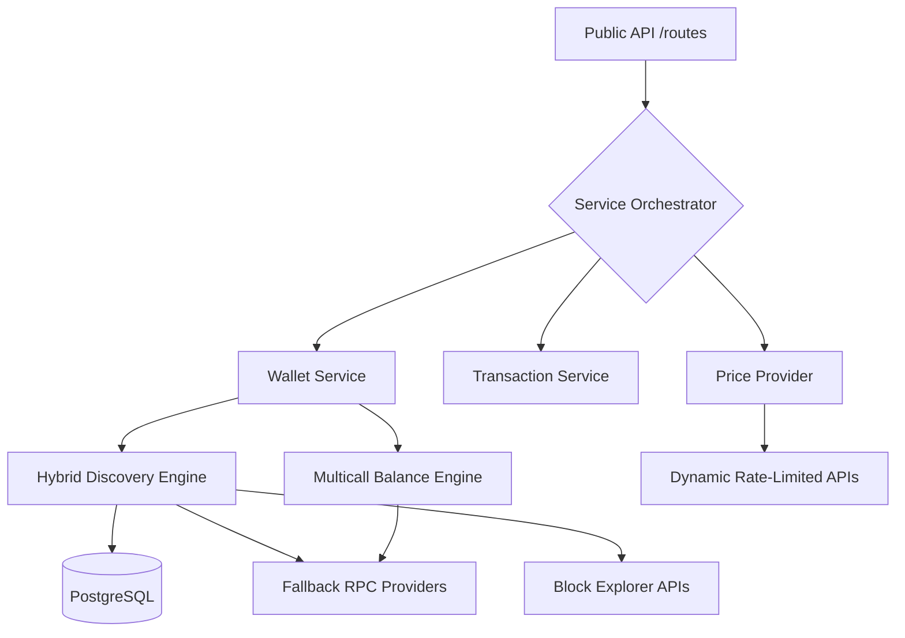

# Wallet Indexer - Functional Requirements Document

---

## Document Information

- **Document Version**: 1.0
- **Date**: December 18, 2024
- **Project**: Wallet Indexer
- **Purpose**: Functional requirements specification for multi-chain wallet indexing system

## 1. Introduction

### 1.1 Purpose

The Wallet Indexer system provides comprehensive wallet data indexing and API services for multiple blockchain networks. It enables real-time tracking of wallet balances, transaction histories, and token metadata with high performance and reliability.

### 1.2 Scope

This document specifies the functional requirements for a wallet indexing system that supports:

- Ethereum, BSC, and Base networks
- Real-time balance tracking
- Transaction history aggregation
- Token metadata management
- RESTful API for data access
- Background indexing and caching

### 1.3 Definitions and Acronyms

- **FRD**: Functional Requirements Document
- **API**: Application Programming Interface
- **RPC**: Remote Procedure Call
- **ERC20**: Ethereum Request for Comment 20 (fungible token standard)
- **TTL**: Time To Live
- **JSONB**: JSON Binary (PostgreSQL data type)

## 2. System Overview

### 2.1 System Architecture

The system follows a service-oriented architecture with the following components:

1. **API Layer**: RESTful endpoints for data access
2. **Indexing Layer**: Background processes for blockchain data collection
3. **Storage Layer**: PostgreSQL database for data persistence
4. **Cache Layer**: In-memory caching for performance
5. **Provider Layer**: RPC provider management with failover

### 2.2 Supported Blockchains

| Chain    | Chain ID | Native Token | Block Time  | Initial Block |
| -------- | -------- | ------------ | ----------- | ------------- |
| Ethereum | 1        | ETH          | ~12 seconds | 12,000,000    |
| BSC      | 56       | BNB          | ~3 seconds  | 7,000,000     |
| Base     | 8453     | ETH          | ~2 seconds  | 1             |

## 3. Functional Requirements

### 3.1 Wallet Data Retrieval

#### FR-1.1: Single Chain Wallet Balance

**Description**: Retrieve complete balance information for a wallet on a specific blockchain
**Priority**: High
**Inputs**:

- Chain ID (integer)
- Wallet address (string, checksummed Ethereum address)
- Optional: Force refresh flag (boolean)

**Outputs**:

- Chain information (ID, name, native token)
- Native token balance (formatted and raw)
- Token holdings array with:
  - Token address
  - Token symbol and name
  - Balance (formatted and raw)
  - USD value and price
  - Portfolio percentage
- Sync status and block number

**Business Rules**:

- Address must be valid Ethereum address format
- Chain ID must be supported
- Returns cached data if available and fresh (< 60 seconds)
- Triggers background refresh for stale data

#### FR-1.2: Multi-Chain Wallet Balance

**Description**: Retrieve balance information across all supported blockchains
**Priority**: High
**Inputs**:

- Wallet address (string)

**Outputs**:

- Aggregated totals (USD value, token count)
- Per-chain breakdown with balance data
- Chain count and summary

#### FR-1.3: Wallet Transaction History

**Description**: Retrieve transaction history for a wallet on a specific chain
**Priority**: Medium
**Inputs**:

- Chain ID (integer)
- Wallet address (string)

**Outputs**:

- Normalized transaction array with:
  - Transaction hash
  - Block number and timestamp
  - From/to addresses
  - Value and token information
  - Transaction type (transfer, contract call, etc.)

### 3.2 Token Management

#### FR-2.1: Token Search

**Description**: Search for tokens by symbol, name, or address
**Priority**: High
**Inputs**:

- Chain ID (integer)
- Search query (string)
- Optional filters: verified status, spam status

**Outputs**:

- Matching tokens array with metadata
- Pagination support (page, limit, total count)

#### FR-2.2: Token Metadata Retrieval

**Description**: Get detailed metadata for specific tokens
**Priority**: Medium
**Inputs**:

- Chain ID (integer)
- Token addresses array

**Outputs**:

- Token details including:
  - Contract address
  - Symbol, name, decimals
  - Logo URL
  - Verification status
  - Spam detection status

### 3.3 Wallet Tracking

#### FR-3.1: Add Tracked Wallet

**Description**: Add a wallet to proactive monitoring
**Priority**: Medium
**Inputs**:

- Wallet address (string)
- Chain IDs array (integers)

**Outputs**:

- Success confirmation
- Triggers initial deep scan

**Business Rules**:

- Prevents duplicate tracking
- Validates address and chain IDs
- Initiates background caching

#### FR-3.2: List Tracked Wallets

**Description**: Retrieve list of all tracked wallets
**Priority**: Low
**Outputs**:

- Wallet array with:
  - Address
  - Tracked chains
  - First/last seen timestamps

#### FR-3.3: Remove Tracked Wallet

**Description**: Stop tracking a wallet
**Priority**: Low
**Inputs**:

- Wallet address (string)

**Outputs**:

- Success confirmation

### 3.4 Background Processing

#### FR-4.1: Real-time Block Scanning

**Description**: Monitor new blocks and update tracked wallets
**Priority**: High
**Requirements**:

- Poll latest blocks every 10 seconds
- Detect wallet interactions in new blocks
- Trigger balance updates for affected wallets
- Handle chain reorganizations

#### FR-4.2: Proactive Wallet Refresh

**Description**: Regularly refresh tracked wallet balances
**Priority**: High
**Requirements**:

- Refresh all tracked wallets every minute
- Use background processing to avoid blocking
- Handle concurrent requests with deduplication

#### FR-4.3: Cache Management

**Description**: Maintain cache freshness and cleanup
**Priority**: Medium
**Requirements**:

- Expire cache entries after 30 minutes
- Clean up expired entries every 10 minutes
- Handle stuck sync operations (auto-recovery after 5 minutes)

## 4. Non-Functional Requirements

### 4.1 Performance

#### NFR-1.1: Response Times

- Cache hit: < 50ms (P95)
- Cache miss: < 200ms (P95)
- Deep scan: < 30 seconds (P95)

#### NFR-1.2: Throughput

- Support 100+ concurrent requests
- Handle 1000+ wallet scans per minute
- Database queries: < 10ms average

#### NFR-1.3: Scalability

- Horizontal scaling support
- Database connection pooling (max 20 connections)
- Configurable worker concurrency

### 4.2 Reliability

#### NFR-2.1: Availability

- 99.9% uptime target
- Graceful degradation on RPC failures
- Automatic recovery from failures

#### NFR-2.2: Data Consistency

- ACID compliance for database operations
- Idempotent operations
- Transaction rollback on failures

#### NFR-2.3: Error Handling

- Comprehensive error logging
- User-friendly error messages
- Graceful failure handling

### 4.3 Security

#### NFR-3.1: Input Validation

- Address format validation
- SQL injection prevention
- XSS protection

#### NFR-3.2: Rate Limiting

- API rate limiting (configurable)
- Request throttling
- Abuse prevention

#### NFR-3.3: Data Privacy

- No sensitive data storage
- Public blockchain data only
- Audit logging

### 4.4 Usability

#### NFR-4.1: API Design

- RESTful conventions
- JSON responses
- Comprehensive documentation

#### NFR-4.2: Error Messages

- Clear error descriptions
- HTTP status code compliance
- Actionable error information

## 5. Data Models

### 5.1 Database Design

The system requires a PostgreSQL database with the following tables:

#### 5.1.1 Core Tables

**token_details**

```sql
CREATE TABLE token_details (
    chain_id INTEGER NOT NULL,
    address TEXT NOT NULL,
    symbol TEXT NOT NULL,
    name TEXT,
    decimals INTEGER,
    logo TEXT,
    verified BOOLEAN DEFAULT false,
    possible_spam BOOLEAN DEFAULT false,
    created_at TIMESTAMP DEFAULT CURRENT_TIMESTAMP,
    updated_at TIMESTAMP DEFAULT CURRENT_TIMESTAMP,
    PRIMARY KEY (chain_id, address)
);

-- Indexes
CREATE INDEX idx_token_details_chain_symbol ON token_details(chain_id, symbol);
CREATE INDEX idx_token_details_verified ON token_details(chain_id, verified);
CREATE INDEX idx_token_details_spam ON token_details(possible_spam);
```

**wallet_cache**

```sql
CREATE TABLE wallet_cache (
    chain_id INTEGER NOT NULL,
    wallet TEXT NOT NULL,
    data JSONB NOT NULL,
    last_updated TIMESTAMP DEFAULT CURRENT_TIMESTAMP,
    expires_at TIMESTAMP,
    syncing BOOLEAN DEFAULT false,
    PRIMARY KEY (chain_id, wallet)
);

-- Indexes
CREATE INDEX idx_wallet_cache_updated ON wallet_cache(last_updated);
CREATE INDEX idx_wallet_cache_expires ON wallet_cache(expires_at);
CREATE INDEX idx_wallet_cache_syncing ON wallet_cache(syncing);
```

**tracked_wallets**

```sql
CREATE TABLE tracked_wallets (
    wallet TEXT PRIMARY KEY,
    chains INTEGER[] DEFAULT '{}',
    first_seen TIMESTAMP DEFAULT CURRENT_TIMESTAMP,
    last_seen TIMESTAMP DEFAULT CURRENT_TIMESTAMP,
    active BOOLEAN DEFAULT true
);

-- Indexes
CREATE INDEX idx_tracked_wallets_active ON tracked_wallets(active);
CREATE INDEX idx_tracked_wallets_last_seen ON tracked_wallets(last_seen);
```

#### 5.1.2 Transaction Tables

**transactions**

```sql
CREATE TABLE transactions (
    chain_id INTEGER NOT NULL,
    hash TEXT NOT NULL,
    block_number BIGINT NOT NULL,
    block_timestamp TIMESTAMP NOT NULL,
    from_address TEXT NOT NULL,
    to_address TEXT,
    value TEXT,
    gas_used BIGINT,
    gas_price TEXT,
    transaction_type TEXT, -- 'native', 'erc20', 'contract'
    token_address TEXT, -- for ERC20 transfers
    token_symbol TEXT,
    PRIMARY KEY (chain_id, hash)
);

-- Indexes
CREATE INDEX idx_transactions_block ON transactions(chain_id, block_number);
CREATE INDEX idx_transactions_from ON transactions(chain_id, from_address);
CREATE INDEX idx_transactions_to ON transactions(chain_id, to_address);
CREATE INDEX idx_transactions_token ON transactions(chain_id, token_address);
CREATE INDEX idx_transactions_timestamp ON transactions(block_timestamp);
```

**wallet_transactions**

```sql
CREATE TABLE wallet_transactions (
    chain_id INTEGER NOT NULL,
    wallet_address TEXT NOT NULL,
    transaction_hash TEXT NOT NULL,
    direction TEXT NOT NULL, -- 'in', 'out', 'self'
    value TEXT,
    token_address TEXT,
    token_symbol TEXT,
    block_timestamp TIMESTAMP NOT NULL,
    PRIMARY KEY (chain_id, wallet_address, transaction_hash)
);

-- Indexes
CREATE INDEX idx_wallet_tx_wallet ON wallet_transactions(chain_id, wallet_address);
CREATE INDEX idx_wallet_tx_timestamp ON wallet_transactions(chain_id, block_timestamp);
CREATE INDEX idx_wallet_tx_token ON wallet_transactions(chain_id, token_address);
```

#### 5.1.3 System Tables

**block_sync_status**

```sql
CREATE TABLE block_sync_status (
    chain_id INTEGER PRIMARY KEY,
    chain_name TEXT NOT NULL,
    latest_block BIGINT NOT NULL,
    synced_block BIGINT NOT NULL,
    last_sync TIMESTAMP DEFAULT CURRENT_TIMESTAMP,
    sync_status TEXT DEFAULT 'active' -- 'active', 'paused', 'error'
);
```

**rpc_providers**

```sql
CREATE TABLE rpc_providers (
    id SERIAL PRIMARY KEY,
    chain_id INTEGER NOT NULL,
    url TEXT NOT NULL,
    name TEXT,
    priority INTEGER DEFAULT 1,
    healthy BOOLEAN DEFAULT true,
    last_check TIMESTAMP DEFAULT CURRENT_TIMESTAMP,
    response_time_ms INTEGER,
    error_count INTEGER DEFAULT 0,
    UNIQUE(chain_id, url)
);

-- Indexes
CREATE INDEX idx_rpc_providers_chain ON rpc_providers(chain_id);
CREATE INDEX idx_rpc_providers_healthy ON rpc_providers(chain_id, healthy);
```

**system_logs**

```sql
CREATE TABLE system_logs (
    id SERIAL PRIMARY KEY,
    level TEXT NOT NULL, -- 'error', 'warn', 'info', 'debug'
    component TEXT NOT NULL, -- 'api', 'scanner', 'cache', 'rpc'
    message TEXT NOT NULL,
    metadata JSONB,
    created_at TIMESTAMP DEFAULT CURRENT_TIMESTAMP
);

-- Indexes
CREATE INDEX idx_system_logs_level ON system_logs(level);
CREATE INDEX idx_system_logs_component ON system_logs(component);
CREATE INDEX idx_system_logs_created ON system_logs(created_at);
```

**api_request_logs**

```sql
CREATE TABLE api_request_logs (
    id SERIAL PRIMARY KEY,
    method TEXT NOT NULL,
    endpoint TEXT NOT NULL,
    ip_address INET,
    user_agent TEXT,
    response_status INTEGER,
    response_time_ms INTEGER,
    created_at TIMESTAMP DEFAULT CURRENT_TIMESTAMP
);

-- Indexes
CREATE INDEX idx_api_logs_endpoint ON api_request_logs(endpoint);
CREATE INDEX idx_api_logs_status ON api_request_logs(response_status);
CREATE INDEX idx_api_logs_created ON api_request_logs(created_at);
```

### 5.2 Data Relationships

```
tracked_wallets (1) ──── (N) wallet_cache
    │                           │
    └── (N) wallet_transactions ─┘
                │
                └── (1) transactions
                        │
                        └── (N) token_details
```

### 5.3 Data Flow

1. **Ingestion**: Block scanner detects new transactions → Updates transactions table
2. **Processing**: Wallet scanner processes transactions → Updates wallet_transactions and wallet_cache
3. **API**: Client requests → Reads from wallet_cache → Triggers refresh if stale
4. **Maintenance**: Cleanup jobs → Remove expired cache entries and old logs

### 5.2 API Data Models

#### Wallet Balance Response

```typescript
interface WalletChainData {
  chainId: number;
  chainName: string;
  native: string;
  result: TokenBalance[];
  syncing: boolean;
  count: number;
  block_number: number;
}

interface TokenBalance {
  token_address: string;
  symbol: string;
  name: string;
  decimals: number;
  balance: string;
  balance_formatted: string;
  usd_price: number;
  usd_value: number;
  portfolio_percentage: number;
}
```

## 6. API Specifications

### 6.1 Endpoints

#### GET /api/wallet/{chain}/{address}

**Purpose**: Get wallet balance for specific chain
**Parameters**:

- `chain`: Chain ID (path)
- `address`: Wallet address (path)
- `refresh`: Force refresh (query, optional)

**Response**: `WalletChainData`

#### GET /api/wallet/{address}

**Purpose**: Get wallet balances across all chains
**Parameters**:

- `address`: Wallet address (path)
- `refresh`: Force refresh (query, optional)

**Response**: Multi-chain balance object

#### GET /api/tokens

**Purpose**: Search tokens
**Parameters**:

- `chainId`: Chain ID (query)
- `searchQuery`: Search term (query)
- `isVerified`: Filter verified tokens (query, optional)
- `isSpam`: Filter spam tokens (query, optional)

**Response**: Token search results with pagination

### 6.2 Error Responses

#### 400 Bad Request

```json
{
  "error": "Invalid address"
}
```

#### 404 Not Found

```json
{
  "error": "Wallet not found in tracking"
}
```

#### 500 Internal Server Error

```json
{
  "error": "Failed to fetch wallet data"
}
```

## 7. Use Cases

### 7.1 Primary Use Cases

#### UC-1: Portfolio Tracking

**Actor**: DeFi application user
**Preconditions**: User has wallet with tokens
**Main Flow**:

1. User provides wallet address
2. System retrieves balances across all chains
3. System returns formatted portfolio data
4. User views token balances and values

#### UC-2: Transaction Monitoring

**Actor**: Wallet application
**Preconditions**: Wallet is being tracked
**Main Flow**:

1. New transactions detected on blockchain
2. System updates wallet cache
3. API returns updated balance data
4. Application displays current balances

#### UC-3: Token Discovery

**Actor**: Developer
**Preconditions**: Need token metadata
**Main Flow**:

1. Developer searches for token by symbol
2. System returns matching tokens
3. Developer retrieves detailed metadata
4. Application integrates token information

## 8. Assumptions and Constraints

### 8.1 Assumptions

- Public RPC endpoints will be available and reliable
- Block explorers provide accurate transaction data
- PostgreSQL database is available and properly configured
- System has sufficient network bandwidth for RPC calls

### 8.2 Constraints

- Maximum 100 concurrent API requests
- 60-second cache TTL for balance data
- Support for Ethereum-compatible blockchains only
- No support for NFT or ERC721 tokens (scope limitation)

## 9. Dependencies

### 9.1 External Dependencies

- **PostgreSQL 14+**: Data storage
- **Node.js 18+**: Runtime environment
- **Ethers.js v5**: Blockchain interaction
- **Express.js**: Web framework

### 9.2 Third-party Services

- **RPC Providers**: For blockchain data access
- **Block Explorers**: For transaction data (Etherscan, BSCScan, etc.)
- **Price Oracles**: For token price data (CoinGecko, etc.)

## 10. Acceptance Criteria

### 10.1 Functional Acceptance Criteria

- [ ] All FR requirements implemented and tested
- [ ] API endpoints return correct data formats
- [ ] Background scanning works for all supported chains
- [ ] Cache invalidation and refresh functions properly
- [ ] Error handling provides meaningful messages

### 10.2 Non-Functional Acceptance Criteria

- [ ] Response times meet performance requirements
- [ ] System handles 100+ concurrent requests
- [ ] 99.9% uptime achieved in testing
- [ ] All security requirements implemented
- [ ] Comprehensive test coverage (80%+)

## 11. Future Enhancements

### 11.1 Phase 2 Features

- Additional blockchain support (Polygon, Avalanche)
- NFT and ERC721 token tracking
- Advanced DeFi protocol integration
- Webhook notifications for wallet activity
- Historical price data and portfolio analytics

### 11.2 Technical Improvements

- Redis caching layer
- GraphQL API support
- Rate limiting with Redis
- Advanced monitoring and alerting
- Mobile SDK development

## Features

- **Multi-Chain Support**: Ethereum, BSC, Base (easily extensible)
- **Real-Time Indexing**: Live block scanners for instant updates
- **Hybrid Asset Discovery**: Combines explorer APIs and recursive log crawling
- **Stale-Fast Portfolio Lifecycle**: Returns cached data instantly while refreshing in background
- **Transaction Normalization**: Unified format for native transfers, ERC20 movements, and contract interactions
- **Spam Filtering**: Built-in token spam detection and filtering
- **Tracked Wallets**: Proactive monitoring and caching for frequently accessed wallets
- **Resilient RPC Management**: Fallback providers with dynamic stall detection

## Architecture

The system follows a modular Service-Oriented Architecture (SOA) with three main layers:

### Service-Oriented Architecture



### Key Components

- **Ingestion Layer**: `blockScanner.ts` monitors real-time head-of-chain data and triggers background refreshes for tracked wallets
- **Processing Layer**: `walletScanner.ts` implements recursive binary bisection for efficient historical log crawling
- **Storage Layer**: PostgreSQL with JSONB for O(1) portfolio retrieval while maintaining relational integrity

### Performance Features

- **Recursive Binary Bisection**: Handles restrictive RPC limits by automatically splitting large block ranges
- **FallbackProvider**: Dynamic RPC rotation with quorum validation
- **Lock & Sync Protection**: Prevents thundering herd issues with promise deduplication
- **Stale-Sync Self-Healing**: Automatic recovery from failed scans

## Installation

1. Clone the repository:

```bash
git clone <repository-url>
cd wallet-indexer
```

2. Install dependencies:

```bash
npm install
```

3. Set up environment variables. Create a `.env` file with:

```env
PGHOST=your-postgres-host
PGUSER=your-postgres-user
PGDATABASE=your-postgres-database
PGPASSWORD=your-postgres-password
PGPORT=5432

# RPC URLs for each chain (multiple providers for fallback)
ETHEREUM_RPC_URL=https://mainnet.infura.io/v3/YOUR_KEY,https://eth-mainnet.g.alchemy.com/v2/YOUR_KEY
BSC_RPC_URL=https://bsc-dataseed.binance.org/,https://bsc-dataseed1.binance.org/
BASE_RPC_URL=https://mainnet.base.org,https://base-mainnet.g.alchemy.com/v2/YOUR_KEY

# API Keys for block explorers
ETHERSCAN_API_KEY=your-etherscan-key
BSCSCAN_API_KEY=your-bscscan-key
BASESCAN_API_KEY=your-basescan-key

# Price provider API keys (if needed)
COINGECKO_API_KEY=your-coingecko-key
```

4. Build the project:

```bash
npm run build
```

5. Start the server:

```bash
npm start
```

For development with hot reload:

```bash
npm run dev
```

## Usage

The server runs on port 3000 by default. It automatically starts block scanners for supported chains and initializes token metadata seeding.

### Configuration Details

#### Chain Configuration

Chains are configured in `src/config/chains.ts`:

```typescript
export const CHAINS = {
  1: {
    name: "ethereum",
    symbol: "ETH",
    rpcs: [
      "https://1rpc.io/eth",
      "https://eth.drpc.org",
      "https://eth.llamarpc.com",
      // ... more fallback RPCs
    ],
  },
  // ... other chains
} as const;
```

#### Start Blocks

Discovery start blocks are defined in `src/config/startBlocks.ts`:

```typescript
export const START_BLOCK: Record<number, number> = {
  1: 12_000_000, // Ethereum
  56: 7_000_000, // BSC
  8453: 1, // Base
};
```

#### Wallet Scan Configuration

Block chunk sizes for scanning are configured in `src/config/walletScan.ts`:

```typescript
export const WALLET_SCAN_BLOCKS: Record<ChainId, number> = {
  1: 50_000, // Ethereum
  56: 100_000, // BSC
  8453: 50_000, // Base
};
```

### API Endpoints

#### Wallet Endpoints

- `GET /api/wallet/:chain/:address` - Get wallet data for specific chain

  - Parameters: `chain` (1=Ethereum, 56=BSC, 8453=Base), `address` (wallet address)
  - Query: `refresh=true` (force refresh)
  - Response: Token balances, USD values, transaction counts

  **Example Response:**

  ```json
  {
    "chainId": 1,
    "chainName": "ethereum",
    "native": "1000000000000000000",
    "cursor": null,
    "page": 0,
    "page_size": 100,
    "block_number": 18500000,
    "result": [
      {
        "token_address": "0xeeeeeeeeeeeeeeeeeeeeeeeeeeeeeeeeeeeeeeee",
        "symbol": "ETH",
        "name": "Ether",
        "decimals": 18,
        "balance": "1000000000000000000",
        "balance_formatted": "1.0",
        "native_token": true,
        "usd_price": 2000.5,
        "usd_value": 2000.5,
        "portfolio_percentage": 95.2
      }
    ],
    "syncing": false,
    "count": 1
  }
  ```

- `GET /api/wallet/:chain/:address/transactions` - Get wallet transactions for specific chain

  - Parameters: `chain`, `address`
  - Response: Normalized transaction history

- `GET /api/wallet/:address` - Get wallet balances across all chains

  - Parameters: `address`
  - Query: `refresh=true`
  - Response: Aggregated balances with global totals

  **Example Response:**

  ```json
  {
    "wallet": "0x1234567890123456789012345678901234567890",
    "total_usd": "5000.75",
    "total_tokens": 15,
    "chains_count": 2,
    "chains": [
      {
        "chainId": 1,
        "chainName": "ethereum"
        // ... wallet data for Ethereum
      }
    ]
  }
  ```

#### Token Endpoints

- `GET /api/tokens` - Search tokens

  - Query: `chainId`, `searchQuery`, `isVerified`, `isSpam`
  - Response: Matching tokens with metadata

  **Example:** `GET /api/tokens?chainId=1&searchQuery=USDC&isVerified=true`

- `GET /api/tokens/:chainId` - Get all tokens for a chain

  - Parameters: `chainId`
  - Query: `page`, `limit`, `isVerified`, `isSpam`
  - Response: Paginated token list

  **Example Response:**

  ```json
  {
    "status": 200,
    "data": {
      "page": 1,
      "limit": 20,
      "totalPages": 50,
      "hasNextPage": true,
      "result": [
        {
          "contractAddress": "0xa0b86a33e6c6c1d0c3b7e8f2d4a6b9c8e7f6a5b4",
          "chainId": 1,
          "chainName": "ethereum",
          "symbol": "USDC",
          "name": "USD Coin",
          "decimals": 6,
          "logo": "https://assets.coingecko.com/coins/images/6319/small/USD_Coin_icon.png",
          "isVerified": true,
          "isSpam": false
        }
      ]
    }
  }
  ```

#### Tracked Wallets Management

- `GET /api/wallets/get-wallet` - Get all tracked wallets

  **Example Response:**

  ```json
  {
    "status": 200,
    "data": {
      "total": 5,
      "wallets": [
        {
          "address": "0x1234567890123456789012345678901234567890",
          "chains": [1, 56],
          "firstSeen": "2024-01-01T00:00:00.000Z",
          "lastSeen": "2024-12-18T11:30:00.000Z"
        }
      ]
    }
  }
  ```

- `POST /api/wallets/add-wallet` - Add wallet to tracking

  - Body: `{ "address": "0x...", "chains": [1, 56] }`

- `DELETE /api/wallets/remove-wallet/:address` - Remove wallet from tracking

### Scripts

#### Main Scripts

- `npm run dev` - Start development server with nodemon (hot reload enabled)
- `npm run build` - Compile TypeScript to JavaScript in `dist/` directory
- `npm run start` - Start production server from compiled code
- `npm run clear-cache` - Clear all wallet cache entries (useful for debugging)

#### Utility Scripts

Located in `src/scripts/`, run with `ts-node`:

- `seedTokens.ts` - Populate token metadata registry from external APIs

  ```bash
  npx ts-node src/scripts/seedTokens.ts
  ```

- `clearCache.ts` - Clear wallet cache (alternative to npm script)

  ```bash
  npx ts-node src/scripts/clearCache.ts
  ```

- `addSpecificTokens.ts` - Add specific tokens to the registry

  ```bash
  npx ts-node src/scripts/addSpecificTokens.ts
  ```

- `cleanInvalidTokens.ts` - Remove tokens with invalid metadata

  ```bash
  npx ts-node src/scripts/cleanInvalidTokens.ts
  ```

- `cleanupDuplicates.ts` - Remove duplicate token entries

  ```bash
  npx ts-node src/scripts/cleanupDuplicates.ts
  ```

- `normalizeAddresses.ts` - Normalize address formats in database

  ```bash
  npx ts-node src/scripts/normalizeAddresses.ts
  ```

- `removeDuplicates.ts` - Remove duplicate wallet cache entries
  ```bash
  npx ts-node src/scripts/removeDuplicates.ts
  ```

## Database Schema

The system uses PostgreSQL with the following tables:

### token_details

Global registry for token metadata.

```sql
CREATE TABLE token_details (
    chain_id INTEGER,
    chain_name TEXT,
    address TEXT,
    symbol TEXT,
    name TEXT,
    decimals INTEGER,
    logo TEXT,
    verified BOOLEAN DEFAULT false,
    possible_spam BOOLEAN DEFAULT false,
    PRIMARY KEY (chain_id, address)
);
```

### wallet_cache

Fast-access document store for portfolios.

```sql
CREATE TABLE wallet_cache (
    chain_id INTEGER,
    wallet TEXT,
    data JSONB,
    last_updated TIMESTAMP DEFAULT CURRENT_TIMESTAMP,
    PRIMARY KEY (chain_id, wallet)
);
CREATE INDEX idx_wallet_cache_updated ON wallet_cache (last_updated);
```

### tracked_wallets

Registry of wallets for proactive monitoring.

```sql
CREATE TABLE tracked_wallets (
    wallet TEXT PRIMARY KEY,
    chains INTEGER[] DEFAULT '{}',
    first_seen TIMESTAMP DEFAULT CURRENT_TIMESTAMP,
    last_seen TIMESTAMP DEFAULT CURRENT_TIMESTAMP
);
```

## Wallet Scanning Process

The wallet scanning process follows a two-phase approach:

### Phase 1: Fast Path (Verified Tokens)

- Checks balances for all verified tokens in the database
- Uses batched multicall requests for efficiency
- Typically finds 80-90% of user holdings
- Completes in 10-15 seconds

### Phase 2: Deep Discovery (Fallback)

- Triggered when few tokens are found in Phase 1
- Uses recursive binary bisection to crawl historical transaction logs
- Handles RPC rate limits by splitting large block ranges
- Can take 1-2 minutes for wallets with extensive transaction history

### Caching Strategy

- **Cache TTL**: 60 seconds for active data
- **Stale-Sync**: Returns stale data immediately while refreshing in background
- **Lock Protection**: Prevents multiple simultaneous scans of the same wallet
- **Auto-Recovery**: Detects and recovers from stuck sync operations

## Chain Profiles

| Chain    | ID   | Avg Discovery | Chunk Size     | Concurrency | Start Block |
| -------- | ---- | ------------- | -------------- | ----------- | ----------- |
| Ethereum | 1    | 1800ms        | 50,000 blocks  | 5 Workers   | 12M         |
| BSC      | 56   | 900ms         | 100,000 blocks | 10 Workers  | 7M          |
| Base     | 8453 | 1200ms        | 50,000 blocks  | 10 Workers  | 1           |

## Performance Tuning

### Environment Variables for Tuning

```env
# Database Connection Pool
PG_MAX_CONNECTIONS=20

# RPC Timeouts (in milliseconds)
RPC_TIMEOUT=4000

# Batch Sizes
TOKEN_BATCH_SIZE=500
MULTICALL_BATCH_SIZE=100

# Cache Settings
CACHE_TTL_MINUTES=1
CLEANUP_INTERVAL_MINUTES=10

# Background Refresh
BACKGROUND_REFRESH_INTERVAL_MINUTES=1
```

### Monitoring

The system provides detailed logging for:

- Scan performance metrics
- RPC provider health
- Cache hit/miss ratios
- Background refresh operations

## Adding a New Chain

To support a new blockchain:

1. Add chain configuration in `src/config/chains.ts`
2. Set discovery start block in `src/config/startBlocks.ts`
3. Register RPC endpoints in environment variables
4. Add block explorer API key and endpoint in relevant services
5. Initialize scanner in `src/server.ts`

## Troubleshooting

### Common Issues

**Database Connection Failed**

- Verify PostgreSQL is running and credentials are correct
- Check firewall settings for database port (default 5432)

**RPC Provider Errors**

- Ensure RPC URLs are accessible and have sufficient rate limits
- Check API keys for premium providers if using paid services

**Slow Initial Scans**

- This is normal for new wallets - the system needs to discover historical transactions
- Subsequent requests will be fast due to caching

**Stuck Sync Operations**

- The system auto-recovers after 5 minutes
- Manual recovery: Clear cache with `npm run clear-cache`

**High Memory Usage**

- Reduce batch sizes in configuration
- Increase database connection pool size if needed
- Monitor for memory leaks in long-running processes
- Consider horizontal scaling for high-load scenarios

#### Database Issues

**Connection Pool Exhausted**

- Increase `PG_MAX_CONNECTIONS` in environment variables
- Check for connection leaks in application code
- Monitor active connections: `SELECT count(*) FROM pg_stat_activity WHERE datname = 'your_database';`
- Implement proper connection cleanup in error handlers

**Migration Errors**

- Ensure database user has CREATE TABLE permissions
- Check for existing tables before running migrations
- Backup database before schema changes
- Use transactions for multi-statement migrations

**Index Performance**

- Monitor slow queries with `EXPLAIN ANALYZE`
- Add composite indexes for common query patterns
- Consider partial indexes for filtered queries
- Regular `VACUUM ANALYZE` maintenance

#### RPC Provider Issues

**Rate Limit Exceeded**

- Implement exponential backoff in retry logic
- Distribute requests across multiple providers
- Cache results to reduce API calls
- Upgrade to premium provider plans

**Provider Downtime**

- Monitor provider health endpoints
- Automatic failover to backup providers
- Alert when primary provider is unavailable
- Maintain provider performance metrics

**Inconsistent Data**

- Compare results across multiple providers
- Implement quorum validation for critical data
- Log discrepancies for manual review
- Use weighted voting for provider selection

#### Performance Issues

**Slow Database Queries**

- Add missing indexes on frequently queried columns
- Optimize JSONB queries with GIN indexes
- Use query result caching
- Consider read replicas for heavy read loads

**High CPU Usage During Scans**

- Reduce concurrency in `walletScan.ts`
- Implement scan queuing for large wallets
- Use worker threads for CPU-intensive operations
- Monitor scan queue depth

**Memory Leaks**

- Profile memory usage with heap snapshots
- Check for retained references in closures
- Implement proper cleanup in promise chains
- Monitor garbage collection patterns

#### API Issues

**Invalid Address Validation**

- Use `ethers.utils.isAddress()` for basic validation
- Implement checksum validation for Ethereum addresses
- Handle both checksummed and non-checksummed inputs
- Provide clear error messages for invalid formats

**CORS Errors in Production**

- Configure `CORS_ORIGIN` environment variable
- Allow specific origins instead of wildcards
- Handle preflight OPTIONS requests properly
- Test CORS configuration with browser dev tools

**Rate Limiting**

- Implement token bucket algorithm
- Use Redis for distributed rate limiting
- Provide clear rate limit headers
- Allow burst requests for legitimate use cases

#### Configuration Issues

**Environment Variables Not Loading**

- Check `.env` file syntax and location
- Ensure variables are prefixed correctly
- Use `dotenv.config()` before accessing variables
- Validate required variables on startup

**Chain Configuration Mismatch**

- Verify chain IDs match across all config files
- Ensure RPC URLs are accessible
- Test provider endpoints manually
- Validate block explorer API keys

**Cache Configuration**

- Monitor cache hit/miss ratios
- Adjust TTL based on data freshness requirements
- Implement cache warming for frequently accessed data
- Handle cache invalidation properly

### Logs and Debugging

Enable verbose logging by setting:

```env
DEBUG=wallet-indexer:*
```

Key log messages to monitor:

- `[chain] Cache hit/miss for wallet`
- `[chain] Background scan started/completed`
- `Cleaned X expired cache entries`

## Contributing

### Code Style

- Use TypeScript with strict type checking
- Follow existing async/await patterns
- Add JSDoc comments for exported functions
- Use ethers.js for all blockchain interactions
- Handle errors with try/catch and proper logging

### Testing

Run tests with:

```bash
npm test
```

### Adding New Chains

1. Add chain configuration to `src/config/chains.ts`
2. Set start block in `src/config/startBlocks.ts`
3. Add RPC URLs to environment variables
4. Update `src/server.ts` to initialize scanner
5. Test with existing wallet addresses

### Database Migrations

Schema changes should be backward compatible. Update `src/db/index.ts` with new table definitions and run the application to apply changes automatically.

## Deployment

### Docker Deployment

1. **Build the Docker image:**

```bash
docker build -t wallet-indexer .
```

2. **Run with environment file:**

```bash
docker run -d \
  --name wallet-indexer \
  -p 3000:3000 \
  --env-file .env \
  wallet-indexer
```

### Production Considerations

- **Database**: Use managed PostgreSQL (AWS RDS, Google Cloud SQL, etc.)
- **Redis**: Consider adding Redis for improved caching performance
- **Load Balancing**: Deploy multiple instances behind a load balancer
- **Monitoring**: Set up monitoring for RPC health, response times, and error rates
- **Backups**: Regular database backups and point-in-time recovery

### Environment Variables for Production

```env
# Production Database
PGHOST=production-db-host
PGUSER=production-user
PGDATABASE=wallet_indexer_prod
PGPASSWORD=secure-password
PGPORT=5432

# Premium RPC Providers (recommended for production)
ETHEREUM_RPC_URL=https://mainnet.infura.io/v3/YOUR_INFURA_KEY,https://eth-mainnet.alchemyapi.io/v2/YOUR_ALCHEMY_KEY
BSC_RPC_URL=https://bsc-dataseed.binance.org/,https://bsc.getblock.io/mainnet/YOUR_GETBLOCK_KEY
BASE_RPC_URL=https://mainnet.base.org,https://base-mainnet.g.alchemy.com/v2/YOUR_ALCHEMY_KEY

# Monitoring
SENTRY_DSN=your-sentry-dsn
LOG_LEVEL=info

# Security
API_KEY_SECRET=your-api-key-secret
CORS_ORIGIN=https://yourdomain.com
```

## Security Considerations

### API Security

- **Rate Limiting**: Implement rate limiting to prevent abuse
- **API Keys**: Use API keys for production deployments
- **CORS**: Configure CORS properly for web applications
- **Input Validation**: All inputs are validated using ethers.js address validation

### Data Security

- **Encryption**: Database credentials should be encrypted
- **Access Control**: Limit database access to necessary services
- **Audit Logging**: Log all API access for security monitoring

### RPC Security

- **Provider Rotation**: Multiple RPC providers prevent single points of failure
- **Rate Limit Handling**: Built-in rate limit detection and fallback
- **Request Signing**: Consider implementing request signing for sensitive operations

## Performance Benchmarks

### Typical Response Times

| Operation            | Cache Hit | Cache Miss | Deep Scan |
| -------------------- | --------- | ---------- | --------- |
| Single Chain Balance | < 50ms    | < 100ms    | 2-5s      |
| Multi-Chain Balance  | < 100ms   | < 200ms    | 5-15s     |
| Token Search         | < 20ms    | N/A        | N/A       |
| Transaction History  | < 100ms   | < 500ms    | N/A       |

### Throughput

- **Concurrent Requests**: 100+ simultaneous requests supported
- **Cache Hit Rate**: 85-95% for tracked wallets
- **Database Queries**: Optimized for < 10ms average response time

### Resource Usage

- **Memory**: 200-500MB baseline, scales with cache size
- **CPU**: Low baseline, spikes during deep scans
- **Network**: 10-50MB/hour depending on scan frequency

## Advanced Configuration

### Custom RPC Providers

To add custom RPC providers, modify `src/config/chains.ts`:

```typescript
export const CHAINS = {
  1: {
    name: "ethereum",
    symbol: "ETH",
    rpcs: [
      "https://your-custom-rpc.com/v1/mainnet",
      "https://backup-rpc.com/v1/mainnet",
      // ... existing providers
    ],
  },
  // ... other chains
} as const;
```

### Custom Token Sources

The system supports multiple token metadata sources. To add a new source, extend `src/services/token/priceProvider.ts`:

```typescript
export class CustomPriceProvider implements PriceProvider {
  async getPrices(
    chainId: ChainId,
    addresses: string[]
  ): Promise<Map<string, number>> {
    // Implement custom price fetching logic
  }
}
```

### Background Job Configuration

Modify cron schedules in `src/server.ts`:

```typescript
// More frequent cache cleanup
cron.schedule("*/5 * * * *", async () => {
  // Custom cleanup logic
});

// Hourly token metadata refresh
cron.schedule("0 * * * *", () => {
  seed().catch(console.error);
});
```

## API Integration Examples

### JavaScript/Node.js

```javascript
const axios = require("axios");

async function getWalletBalance(chainId, address) {
  try {
    const response = await axios.get(
      `http://localhost:3000/api/wallet/${chainId}/${address}`
    );
    return response.data;
  } catch (error) {
    console.error("Error fetching wallet balance:", error);
  }
}

async function searchTokens(chainId, query) {
  try {
    const response = await axios.get("http://localhost:3000/api/tokens", {
      params: { chainId, searchQuery: query, isVerified: true },
    });
    return response.data;
  } catch (error) {
    console.error("Error searching tokens:", error);
  }
}
```

### Python

```python
import requests
import json
from typing import Dict, List, Optional

class WalletIndexerClient:
    def __init__(self, base_url: str = "http://localhost:3000"):
        self.base_url = base_url
        self.session = requests.Session()

    def get_wallet_balance(self, chain_id: int, address: str, refresh: bool = False) -> Dict:
        """Get wallet balance for a specific chain"""
        params = {"refresh": "true"} if refresh else {}
        response = self.session.get(f"{self.base_url}/api/wallet/{chain_id}/{address}", params=params)
        response.raise_for_status()
        return response.json()

    def get_multi_chain_balance(self, address: str, refresh: bool = False) -> Dict:
        """Get wallet balances across all chains"""
        params = {"refresh": "true"} if refresh else {}
        response = self.session.get(f"{self.base_url}/api/wallet/{address}", params=params)
        response.raise_for_status()
        return response.json()

    def search_tokens(self, chain_id: int, query: str, verified_only: bool = True) -> Dict:
        """Search for tokens on a specific chain"""
        params = {
            "chainId": chain_id,
            "searchQuery": query,
            "isVerified": verified_only
        }
        response = self.session.get(f"{self.base_url}/api/tokens", params=params)
        response.raise_for_status()
        return response.json()

    def get_chain_tokens(self, chain_id: int, page: int = 1, limit: int = 20) -> Dict:
        """Get paginated list of tokens for a chain"""
        params = {"page": page, "limit": limit}
        response = self.session.get(f"{self.base_url}/api/tokens/{chain_id}", params=params)
        response.raise_for_status()
        return response.json()

    def add_tracked_wallet(self, address: str, chains: List[int]) -> Dict:
        """Add a wallet to tracking"""
        data = {"address": address, "chains": chains}
        response = self.session.post(f"{self.base_url}/api/wallets/add-wallet", json=data)
        response.raise_for_status()
        return response.json()

    def get_tracked_wallets(self) -> Dict:
        """Get all tracked wallets"""
        response = self.session.get(f"{self.base_url}/api/wallets/get-wallet")
        response.raise_for_status()
        return response.json()

    def remove_tracked_wallet(self, address: str) -> Dict:
        """Remove a wallet from tracking"""
        response = self.session.delete(f"{self.base_url}/api/wallets/remove-wallet/{address}")
        response.raise_for_status()
        return response.json()

# Usage example
client = WalletIndexerClient()

# Get Ethereum balance
balance = client.get_wallet_balance(1, "0x1234567890123456789012345678901234567890")
print(f"ETH Balance: {balance}")

# Search for tokens
tokens = client.search_tokens(56, "CAKE")
print(f"Found {tokens['data']['total']} CAKE-related tokens")

# Add wallet to tracking
result = client.add_tracked_wallet("0x1234567890123456789012345678901234567890", [1, 56])
print(f"Wallet tracking: {result['message']}")
```

### cURL Examples

```bash
# Get wallet balance for Ethereum
curl "http://localhost:3000/api/wallet/1/0x1234567890123456789012345678901234567890"

# Force refresh wallet data
curl "http://localhost:3000/api/wallet/1/0x1234567890123456789012345678901234567890?refresh=true"

# Search for verified tokens on BSC
curl "http://localhost:3000/api/tokens?chainId=56&searchQuery=CAKE&isVerified=true"

# Get all tracked wallets
curl "http://localhost:3000/api/wallets/get-wallet"

# Add a wallet to tracking
curl -X POST "http://localhost:3000/api/wallets/add-wallet" \
  -H "Content-Type: application/json" \
  -d '{"address": "0x1234567890123456789012345678901234567890", "chains": [1, 56]}'
```

## Monitoring and Observability

### Health Check Endpoint

```bash
curl http://localhost:3000/health
```

Response:

```json
{
  "status": "healthy",
  "timestamp": "2024-12-18T11:37:00.000Z",
  "version": "1.0.0",
  "database": "connected",
  "rpc_providers": {
    "ethereum": "healthy",
    "bsc": "healthy",
    "base": "healthy"
  }
}
```

### Metrics to Monitor

- **Response Time**: P95 response time should be < 500ms
- **Error Rate**: Should be < 1%
- **Cache Hit Rate**: Should be > 80%
- **Active Connections**: Database connection pool usage
- **RPC Failover**: Count of provider switches

### Logging

The system uses structured logging with the following levels:

- **ERROR**: Critical errors requiring immediate attention
- **WARN**: Warning conditions that don't stop operation
- **INFO**: General operational messages
- **DEBUG**: Detailed debugging information

## Development

### Key Implementation Details

#### Wallet Scanning Algorithm

The system implements a two-phase wallet scanning approach:

1. **Fast Path**: Checks balances for all verified tokens using multicall contracts
2. **Deep Discovery**: Falls back to log crawling with recursive binary bisection for comprehensive coverage

#### Caching Strategy

- **TTL-based expiration**: 60-second cache lifetime
- **Stale-while-revalidate**: Returns cached data while refreshing in background
- **Promise deduplication**: Prevents multiple simultaneous scans of the same wallet

#### RPC Provider Management

- **FallbackProvider**: Automatic failover between multiple RPC endpoints
- **Health monitoring**: Tracks provider performance and switches on failures
- **Rate limit handling**: Implements backoff strategies for rate-limited providers

---
